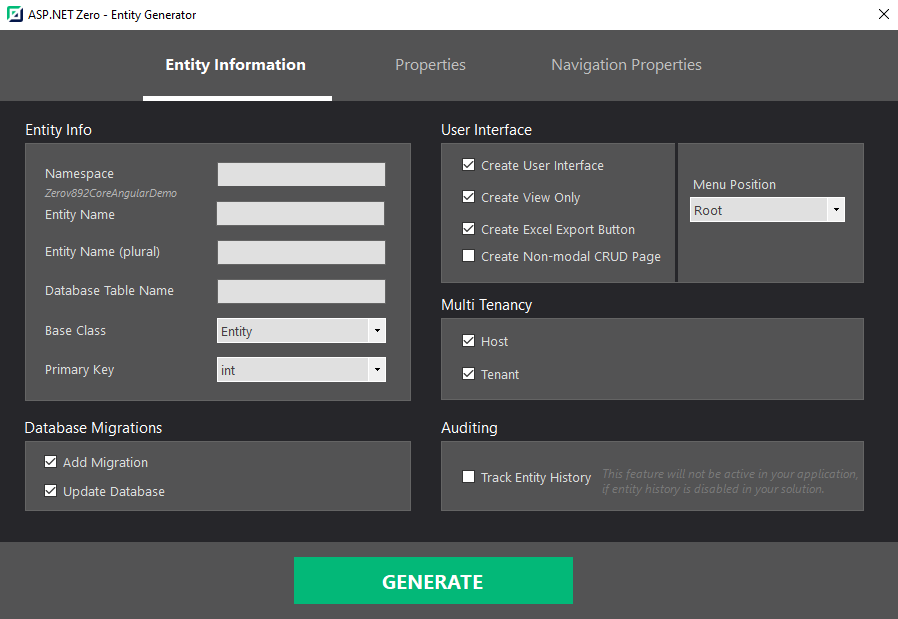
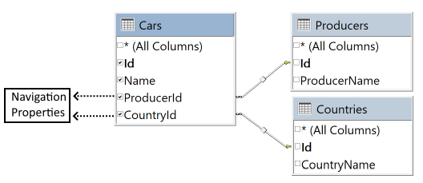

# Development Guide

In this document, we will introduce **ASP.NET Zero Power Tools** and explain it. ASP.NET Zero Power Tools minimizes the effort for creating CRUD pages. It generates all the layers from the database to the user interface by just defining an entity. 

ASP.NET Zero Power Tools supports ASP.NET Zero v5.0.0 and above versions.

## Download And Install

If your project version is 5.0.0+, all you have to do is just install the **ASP.NET Zero Power Tools** extension on Visual Studio from [marketplace](https://marketplace.visualstudio.com/items?itemName=Volosoft.AspNetZeroPowerTools) or from Visual Studio's Extension and Updates menu.


## How To Use It?

After the installation, you need to restart the Visual Studio. You can then find the extension inside the Visual Studio's **Tools** menu (Tools -> Asp.Net Zero). 

For example, clicking the "Tools -> Asp.Net Zero -> Create Entity" opens the window shown below. After carefully filling out the fields, press the **Generate** button to start the code generation process. 



 A console will appear and give you information about the process during the code generation. If there is no warning or failure, run your project to see the results. If you don't see the new page on UI, grant yourself the required **permissions** in the application.

> If you are working on ASP.NET Core & Angular template, after generating the entity via Power Tools, run your ***.Web.Host** project and then run "**./angular/nswag/refresh.bat**" to update **service-proxies.ts**. Otherwise, you will see errors when building your Angular application.

> Be sure that you have saved your work before running this tool since it will add new files and modify some of the existing files. We strongly recommend using a source control system (like Git).  Otherwise, backup your project.

## How It Works?

DLLs (that are inside the ```aspnet-core\AspNetZeroRadTool``` folder in your solution) do all the work. The extension is just a user interface. Since the tool is built with .NET Core, **Mac** or **Linux** users can safely use it without the user interface.

Using ASP.NET Zero Power Tools on Mac and Linux requires a bit more effort. You have to create a [ JSON file](https://aspnetzero.com/Documents/Development-Guide-Rad-Tool-Mac-Linux) as input for code generation manually. For using ASP.NET Zero Power Power Tools in Mac or Linux, please check [Development Guide(Max/Linux) document](Development-Guide-Rad-Tool-Mac-Linux).

## Navigation Properties

A navigation property is a type of property on an entity that allows for navigation from one end of an association to the other end. Unlike other properties, navigation properties do not carry data.

Navigation properties provide a way to navigate an association between two entity types. Every object can have a navigation property for every relationship in which it participates. In ASP.NET Zero, a navigation property allows you create a button on the data table, where you can pick a record from a look up table.

Power Tools allow you to create a navigation property for only **1-to-many (1:N)** relationships.

In this scenario there are multiple records from one entity associated with a single record from another entity. This means you have a parent (or primary) entity and many related (or child) entities.

- `Car` entity (1) is associated to `Producer` entity (N). 
- `Car` entity (1) is associated to `Country` entity (N).

*Currently there's no support for many-to-1 (N:1) or many-to-many (N:N) relationships!*

A foreign keys is automatically being created for each navigation property.

The diagram below shows a conceptual model with three entity types: `Car`, `Producer` and `Country`. 
Navigation properties are `Producer` and `Country` that are defined on the `Car` entity. 




## How To Edit Pre-defined Templates Or Create A New Template?

 The templates are inside "/AspNetZeroRadTool/FileTemplates" directory in your project's root directory. Every template is split into three files: "MainTemplate.txt", "PartialTemplates.txt" and "TemplateInfo.txt". If you want to edit any file, just copy it in same directory and change it's extension to ".custom.txt" from ".txt".  For example, you can create "MainTemplate.custom.txt" to override "MainTemplate.txt" in same directory. Please don't make any changes to the original templates.

To create a new template, do the same process as editing a pre-defined template. The tool doesn't know any info about templates and discovers them in the "/FileTemplates" directory every time it is run. This means your new template will be processed like the pre-defined ones. (".custom" extension is not needed for new templates.)

 You can report your issues or ask questions on [GitHub](https://github.com/aspnetzero/aspnet-zero-core) or [support.aspnetzero.com](https://support.aspnetzero.com).

## How To Change Destination Path Of New Files?

To change the destination path of a template, find the template folder of it in "AspNetZeroRadTool/FileTemplates" directory and edit the content of **TemplateInfo.txt** file.

Also, if you have moved a file that is going to be modified during rad tool generation, you can modify "AspNetZeroRadTool/**config.json**" file and set the new path of this file.


## Generated Files

 Here is the full list of the files that are created or modified by the tool, if you give a basic "Cars" entity as input.

### Server Side

**Files that are being created**

 -   Car.cs
 -   CarDto.cs
 -   LookupDto.cs
 -   GetAllForLookupTableInput.cs
 -   GetCarForEditOutput.cs
 -   GetAllCarsOutput.cs
 -   CreateOrEditCarDto.cs
 -   GetAllCarsInput.cs
 -   CarConsts.cs
 -   ICarAppService
 -   CarAppService
 -   CarsExcelExporter.cs
 -   ICarsExcelExporter.cs

**Files that are being modified**

 -   AppAuthorizationProvider.cs
 -   AppPermissions.cs
 -   ProjectNameDbContext.cs
 -   CustomDtoMapper.cs
 -   ProjectName.xml (English localization file)

 (Optionally, adds a database migration and updates the database.)


### Client Side

#### Angular

**Files that are being created**

 -   cars.component.ts
 -   cars.component.html
 -   create-or-edit-car-modal.component.ts or create-or-edit-car.component.ts (if "Create Non-modal  CRUD Page" is selected)
 -   create-or-edit-car-modal.component.html or create-or-edit-car.component.html (if "Create Non-modal  CRUD Page" is selected)
 -   view-car-modal.component.ts or view-car.component.ts (if "Create Non-modal  CRUD Page" is selected)
 -   view-car-modal.component.html or view-car.component.ts (if "Create Non-modal  CRUD Page" is selected)
 -   Lookup-Table-modal.component.ts
 -   Lookup-Table-modal.component.html
 -   Lookup-Table-modal.component.less

**Files that are being modified**

 -   app-navigation.service.ts
 -   service-proxy.module.ts
 -   (Main or Admin)-routing.module.ts
 -   (Main or Admin).module.ts

#### Mvc

**Files that are being created**

 -   CarsController.cs
 -   CarsViewModel.cs
 -   CreateOrEditCarViewModel.cs
 -   Index.js
 -   Index.cshtml
 -   CreateOrEditModal.js or CreateOrEdit.js (if "Create Non-modal  CRUD Page" is selected)
 -   CreateOrEditModal.cshtml  or CreateOrEdit.cshtml (if "Create Non-modal  CRUD Page" is selected)
 -   ViewCarModal.cshtml  or ViewCar.cshtml (if "Create Non-modal  CRUD Page" is selected)
 -   LookupTableViewModel.cshtml
 -   LookupTableModal.js
 -   LookupTableModal.cshtml

**Files that are being modified**

 -   (AppArea)NavigationProvider.cs
 -   (AppArea)PageNames.cs

>   Note that lookup files are being created per foreign key.
>

 

## Final Result

The below image shows a generated page which list records, allows filtering, inserting, deleting, updating and exporting excel functionalities.

This is the record edit model where you can update an existing record.

