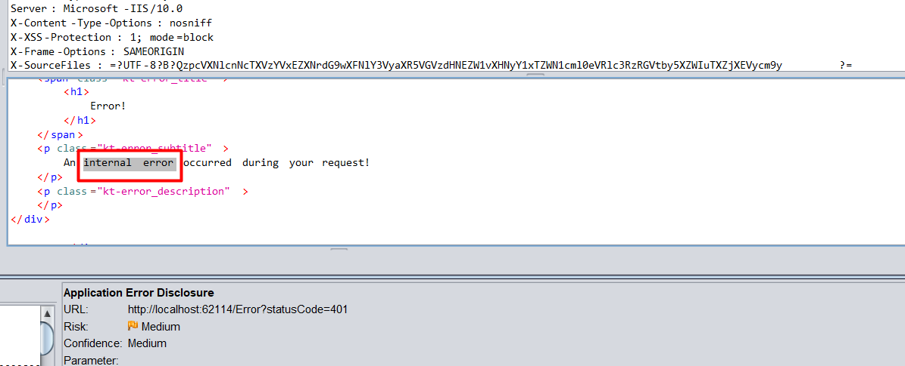
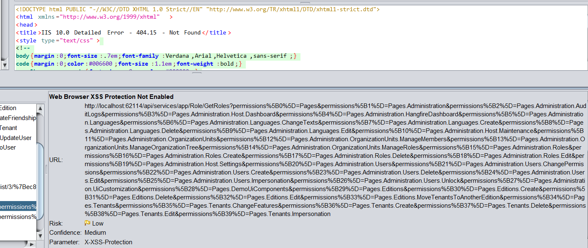
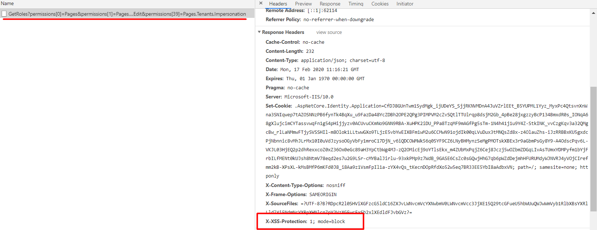

# ASP.NET ZERO Penetration Test Report

ASP.NET Zero (v8.1) has been scanned for vulnerabilities with the latest version of [OWASP ZAP (v2.9.0)](https://www.owasp.org/index.php/OWASP_Zed_Attack_Proxy_Project). The OWASP Zed Attack Proxy (ZAP) is one of the world's most popular security tools and is actively maintained by hundreds of international volunteers. 

The automated scanner has been reported several alerts.  ASP.NET Zero Team has fixed the positive alerts regarding the report. On the other hand most of the alerts can be stated as false-positive. The reasons for the false-positive alerts that are subject to these issues are clearly stated below.

## Summary of Alerts

### Path Traversal

##### Risk: High

#### Description

The Path Traversal attack technique allows an attacker access to files, directories, and commands that potentially reside outside the web document root directory. 

#### Comment

* Url: [http://localhost:62114/api/services/app/Role/GetRoles?permissions[X]=GetRoles](http://localhost:62114/api/services/app/Role/GetRoles?permissions%5B0%5D=Pages&permissions%5B1%5D=Pages.Administration&permissions%5B2%5D=Pages.Administration.AuditLogs&permissions%5B3%5D=GetRoles&permissions%5B4%5D=Pages.Administration.HangfireDashboard&permissions%5B5%5D=Pages.Administration.Languages&permissions%5B6%5D=Pages.Administration.Languages.ChangeTexts&permissions%5B7%5D=Pages.Administration.Languages.Create&permissions%5B8%5D=Pages.Administration.Languages.Delete&permissions%5B9%5D=Pages.Administration.Languages.Edit&permissions%5B10%5D=Pages.Administration.Host.Maintenance&permissions%5B11%5D=Pages.Administration.OrganizationUnits&permissions%5B12%5D=Pages.Administration.OrganizationUnits.ManageMembers&permissions%5B13%5D=Pages.Administration.OrganizationUnits.ManageOrganizationTree&permissions%5B14%5D=Pages.Administration.OrganizationUnits.ManageRoles&permissions%5B15%5D=Pages.Administration.Roles&permissions%5B16%5D=Pages.Administration.Roles.Create&permissions%5B17%5D=Pages.Administration.Roles.Delete&permissions%5B18%5D=Pages.Administration.Roles.Edit&permissions%5B19%5D=Pages.Administration.Host.Settings&permissions%5B20%5D=Pages.Administration.Users&permissions%5B21%5D=Pages.Administration.Users.ChangePermissions&permissions%5B22%5D=Pages.Administration.Users.Create&permissions%5B23%5D=Pages.Administration.Users.Delete&permissions%5B24%5D=Pages.Administration.Users.Edit&permissions%5B25%5D=Pages.Administration.Users.Impersonation&permissions%5B26%5D=Pages.Administration.Users.Unlock&permissions%5B27%5D=Pages.Administration.UiCustomization&permissions%5B28%5D=Pages.DemoUiComponents&permissions%5B29%5D=Pages.Editions&permissions%5B30%5D=Pages.Editions.Create&permissions%5B31%5D=Pages.Editions.Delete&permissions%5B32%5D=Pages.Editions.Edit&permissions%5B33%5D=Pages.Editions.MoveTenantsToAnotherEdition&permissions%5B34%5D=Pages.Tenants&permissions%5B35%5D=Pages.Tenants.ChangeFeatures&permissions%5B36%5D=Pages.Tenants.Create&permissions%5B37%5D=Pages.Tenants.Delete&permissions%5B38%5D=Pages.Tenants.Edit&permissions%5B39%5D=Pages.Tenants.Impersonation)

  * Parameter: permissions[3]

  * Attack: GetRoles

    This request is false-positive because the tool is checking whether a request can get data with unexpected parameter. Since `admin` role has all permissions as a default, response always has `admin` role.

### Recommendation

If your application has to accept input file names, file paths, or URL paths, you need to validate that the path is in the correct format and that it points to a valid location within the context of your application. To prevent a malicious user manipulating your code's file operations, avoid writing code that accepts user-supplied file or path input. 

- If you must accept file names as input, use the full name of the file by using **System.IO.Path.GetFileName**. 
- If you must accept file paths as input, use the full file path by using **System.IO.Path.GetFullPath**.

If you use **MapPath** to map a supplied virtual path to a physical path on the server, use the overload of **Request.MapPath** that accepts a **bool** parameter so that you can prevent cross-application mapping. 

### Application Error Disclosure

##### Risk: Medium

#### Description

This page contains an error/warning message that may disclose sensitive information like the location of the file that produced the unhandled exception. This information can be used to launch further attacks against the web application. The alert could be a false positive if the error message is found inside a documentation page.

#### Comment

- URL: http://localhost:62114/AbpScripts/GetScripts?v=637170099309929078
  - Method: `GET`
  
  This request is false-positive because the tool is checking whether the response contains **"internal error"** text. The response of `GetScripts` contains translations which includes **"internal error"** text.

  

* URL: http://localhost:62114/Error?statusCode=401

  * Method: `Get`

  This request is false-positive because the tool is checking whether the response contains **"internal error"** text. The response contains that but without sensitive information.

  

ASP.NET Zero never returns error details, if only developer sends it deliberatively.  When the project runs on development, exceptions are being sent to client. But publishing application in release mode prevents exception details to be sent. While `MVC` project shows a custom error page, `Host` project sends a JSON with message "*An internal error occurred during your request!*"

### Absence of Anti-CSRF Tokens

##### Risk: Low 

#### Description

In short, CSRF abuses the **trust** relationship between **browser and server**. This means that anything that a server uses in order to establish trust with a browser (e.g., cookies, but also HTTP/Windows Authentication) is exactly what allows CSRF to take place - but this only the first piece for a successful CSRF attack.

#### Comment

ASP.NET Boilerplate has it's own [built-in AntiForgery system](https://aspnetboilerplate.com/Pages/Documents/XSRF-CSRF-Protection). ASP.NET Zero uses ajax to post most of the forms. All URLs listed is false-positive. ASP.NET Zero post them via using ajax and their ajax requests has **X-XSRF-TOKEN** header.

### Application Error Disclosure

##### Risk: Low

#### Description

This page contains an error/warning message that may disclose sensitive information like the location of the file that produced the unhandled exception. This information can be used to launch further attacks against the web application. The alert could be a false positive if the error message is found inside a documentation page.

#### Comment

ASP.NET Boilerplate has it's own [built-in exception handling system](https://aspnetboilerplate.com/Pages/Documents/Handling-Exceptions). When an exception happens ASP.NET Boilerplate catches it and throws user friendly exception. This requests are false-positive because the tool is checking whether the response return **"HTTP 501 (Internal Server Error)"**. But returned errors don't contains internal error. 

- URL: http://localhost:62114/api/services/app/Edition/CreateEdition

  - Method: `Post`

  - Evidence: HTTP/1.1 500 Internal Server Error

    

- Url: http://localhost:62114/api/services/app/Friendship/CreateFriendshipRequest

  - Method: `Post`
  - Evidence: HTTP/1.1 500 Internal Server Error

- Url: http://localhost:62114/api/services/app/Tenant/CreateTenant

  - Method: `Post`
  - Evidence: HTTP/1.1 500 Internal Server Error

- Url: http://localhost:62114/api/services/app/User/CreateOrUpdateUser

  - Method: `Post`
  - Evidence: HTTP/1.1 500 Internal Server Error

- Url: http://localhost:62114/api/services/app/UserLink/LinkToUser

  - Method: `Post`
  - Evidence: HTTP/1.1 500 Internal Server Error
  - 

### Cookie Without SameSite Attribute

##### Risk: Low

#### Description

A cookie has been set without the `SameSite` attribute, which means that the cookie can be sent as a result of a 'cross-site' request. The `SameSite` attribute is an effective counter measure to cross-site request forgery, cross-site script inclusion, and timing attacks.

#### Comment

Solved on https://github.com/aspnetzero/aspnet-zero-core/issues/2950

### Web Browser XSS Protection Not Enabled

##### Risk: Low

#### Description

Web Browser XSS Protection is not enabled, or is disabled by the configuration of the 'X-XSS-Protection' HTTP response header on the web server

#### Comment

ASP.NET Boilerplate framework **v3.4.X** adds the `X-XSS-Protection` header to all responses with the value `1; mode=block`.  If you want to remove the header you can do it via `UseAbp()` options in `Configure ` method of `Startup` class.

This requests are false-positive because the tool is checking whether the response has **X-XSS-Protection**. Response don't have **X-XSS-Protection** because request gets **404.15 - Not Found**.

* Url: [http://localhost:62114/api/services/app/Role/GetRoles?permissions...](http://localhost:62114/api/services/app/Role/GetRoles?permissions%5B0%5D=Pages&permissions%5B1%5D=Pages.Administration&permissions%5B2%5D=Pages.Administration.AuditLogs&permissions%5B3%5D=Pages.Administration.Host.Dashboard&permissions%5B4%5D=Pages.Administration.HangfireDashboard&permissions%5B5%5D=Pages.Administration.Languages&permissions%5B6%5D=Pages.Administration.Languages.ChangeTexts&permissions%5B7%5D=Pages.Administration.Languages.Create&permissions%5B8%5D=Pages.Administration.Languages.Delete&permissions%5B9%5D=Pages.Administration.Languages.Edit&permissions%5B10%5D=Pages.Administration.Host.Maintenance&permissions%5B11%5D=Pages.Administration.OrganizationUnits&permissions%5B12%5D=Pages.Administration.OrganizationUnits.ManageMembers&permissions%5B13%5D=Pages.Administration.OrganizationUnits.ManageOrganizationTree&permissions%5B14%5D=Pages.Administration.OrganizationUnits.ManageRoles&permissions%5B15%5D=Pages.Administration.Roles&permissions%5B16%5D=Pages.Administration.Roles.Create&permissions%5B17%5D=Pages.Administration.Roles.Delete&permissions%5B18%5D=Pages.Administration.Roles.Edit&permissions%5B19%5D=Pages.Administration.Host.Settings&permissions%5B20%5D=Pages.Administration.Users&permissions%5B21%5D=Pages.Administration.Users.ChangePermissions&permissions%5B22%5D=Pages.Administration.Users.Create&permissions%5B23%5D=Pages.Administration.Users.Delete&permissions%5B24%5D=Pages.Administration.Users.Edit&permissions%5B25%5D=Pages.Administration.Users.Impersonation&permissions%5B26%5D=Pages.Administration.Users.Unlock&permissions%5B27%5D=Pages.Administration.UiCustomization&permissions%5B28%5D=Pages.DemoUiComponents&permissions%5B29%5D=Pages.Editions&permissions%5B30%5D=Pages.Editions.Create&permissions%5B31%5D=Pages.Editions.Delete&permissions%5B32%5D=Pages.Editions.Edit&permissions%5B33%5D=Pages.Editions.MoveTenantsToAnotherEdition&permissions%5B34%5D=Pages.Tenants&permissions%5B35%5D=Pages.Tenants.ChangeFeatures&permissions%5B36%5D=Pages.Tenants.Create&permissions%5B37%5D=Pages.Tenants.Delete&permissions%5B38%5D=Pages.Tenants.Edit&permissions%5B39%5D=Pages.Tenants.Impersonation)

  * 

  * But request without **404.15** error has that header.

    

* Url: [http://localhost:62114/api/services/app/Role/GetRoles?permissions...](http://localhost:62114/api/services/app/Role/GetRoles?permissions%5B0%5D=Pages.Administration.AuditLogs&permissions%5B1%5D=Pages.Administration.Host.Dashboard&permissions%5B2%5D=Pages.Administration.HangfireDashboard&permissions%5B3%5D=Pages.Administration.Languages.ChangeTexts&permissions%5B4%5D=Pages.Administration.Languages.Create&permissions%5B5%5D=Pages.Administration.Languages.Delete&permissions%5B6%5D=Pages.Administration.Languages.Edit&permissions%5B7%5D=Pages.Administration.Languages&permissions%5B8%5D=Pages.Administration.Host.Maintenance&permissions%5B9%5D=Pages.Administration.OrganizationUnits.ManageMembers&permissions%5B10%5D=Pages.Administration.OrganizationUnits.ManageOrganizationTree&permissions%5B11%5D=Pages.Administration.OrganizationUnits.ManageRoles&permissions%5B12%5D=Pages.Administration.OrganizationUnits&permissions%5B13%5D=Pages.Administration.Roles.Create&permissions%5B14%5D=Pages.Administration.Roles.Delete&permissions%5B15%5D=Pages.Administration.Roles.Edit&permissions%5B16%5D=Pages.Administration.Roles&permissions%5B17%5D=Pages.Administration.Host.Settings&permissions%5B18%5D=Pages.Administration.Users.ChangePermissions&permissions%5B19%5D=Pages.Administration.Users.Create&permissions%5B20%5D=Pages.Administration.Users.Delete&permissions%5B21%5D=Pages.Administration.Users.Edit&permissions%5B22%5D=Pages.Administration.Users.Impersonation&permissions%5B23%5D=Pages.Administration.Users.Unlock&permissions%5B24%5D=Pages.Administration.Users&permissions%5B25%5D=Pages.Administration.UiCustomization&permissions%5B26%5D=Pages.Administration&permissions%5B27%5D=Pages.DemoUiComponents&permissions%5B28%5D=Pages.Editions.Create&permissions%5B29%5D=Pages.Editions.Delete&permissions%5B30%5D=Pages.Editions.Edit&permissions%5B31%5D=Pages.Editions.MoveTenantsToAnotherEdition&permissions%5B32%5D=Pages.Editions&permissions%5B33%5D=Pages.Tenants.ChangeFeatures&permissions%5B34%5D=Pages.Tenants.Create&permissions%5B35%5D=Pages.Tenants.Delete&permissions%5B36%5D=Pages.Tenants.Edit&permissions%5B37%5D=Pages.Tenants.Impersonation&permissions%5B38%5D=Pages.Tenants&permissions%5B39%5D=Pages)

### Cookie No HttpOnly Flag

##### Low (Medium)

#### Description

A cookie has been set without the `HttpOnly` flag, which means that the cookie can be accessed by JavaScript. If a malicious script can be run on this page then the cookie will be accessible and can be transmitted to another site. If this is a session cookie then session hijacking may be possible.

#### Comment

ASP.NET Zero uses `HttpOnly` flag wherever it needs. In some cases the tool reports false-positive alerts. See the following instances to understand why they are false-positive.

- URL: [http://localhost:62114/Account/SwitchToLinkedAccountSignIn?tokenId=86d58f40-1db2-4fc9-9ee7-56cf70cb7bd6](http://localhost:62114/Account/SwitchToLinkedAccountSignIn?tokenId=86d58f40-1db2-4fc9-9ee7-56cf70cb7bd6)
  - Method: `GET`
  - Parameter: `idsrv.session`
  - Evidence: `Set-Cookie: idsrv.session`

  In the above request, `idsrv.session`  cookie is being set by [Microsoft Identity Server](https://github.com/IdentityServer/IdentityServer4). By design this is not `HttpOnly` . It is required by the OIDC session management spec for SPA clients. For the related spec see https://openid.net/specs/openid-connect-session-1_0.html#ChangeNotification .

- URL: [http://localhost:62114/App/Dashboard](http://localhost:62114/App/Dashboard), http://localhost:62114/App/AuditLogs, http://localhost:62114/App/DemoUiComponents, http://localhost:62114/App/Editions, http://localhost:62114/App/HostDashboard, http://localhost:62114/App/HostSettings, http://localhost:62114/App/Languages, http://localhost:62114/App/Languages/Texts?languageName=cy, http://localhost:62114/App/Maintenance, http://localhost:62114/App/OrganizationUnits, http://localhost:62114/App/Roles, http://localhost:62114/App/Tenants, http://localhost:62114/App/UiCustomization, http://localhost:62114/App/Users
  - Method: `GET`
  - Parameter: `XSRF-TOKEN`
  - Evidence: `Set-Cookie: XSRF-TOKEN`

  Setting `XSRF-TOKEN` as `HttpOnly` is pointless because in Angular UI client must access this cookie. 

### Reference

For all the other OWASP standardizations, download the OWASP sheet.

[Open Web Application Security Project (OWASP) - Application Security Verification Standard 3.0 PDF sheet ](https://www.owasp.org/images/6/67/OWASPApplicationSecurityVerificationStandard3.0.pdf) 

https://owasp.org/www-community/Anti_CRSF_Tokens_ASP-NET