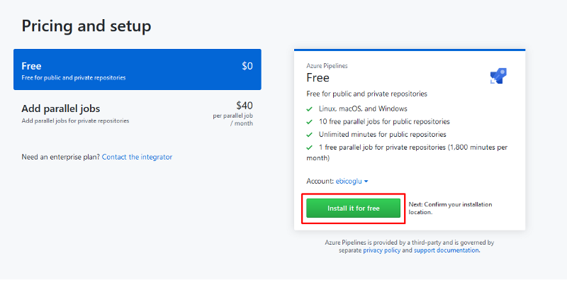
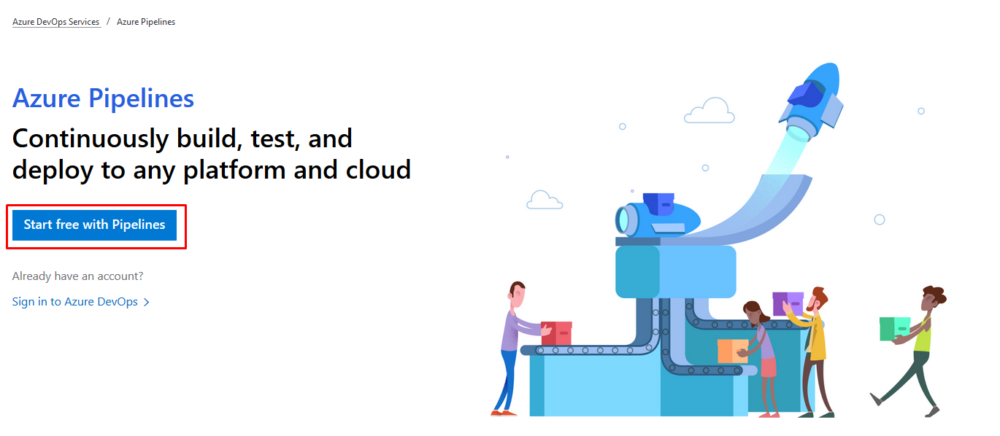
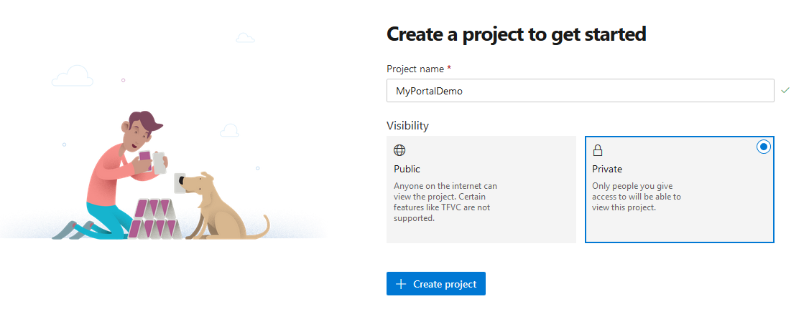
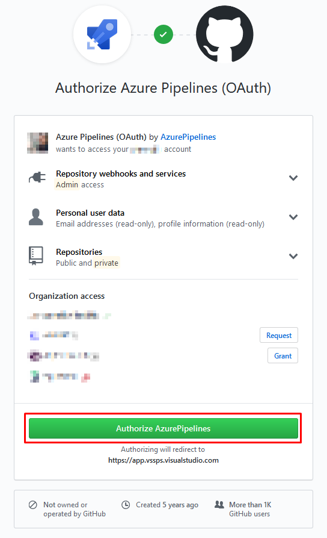
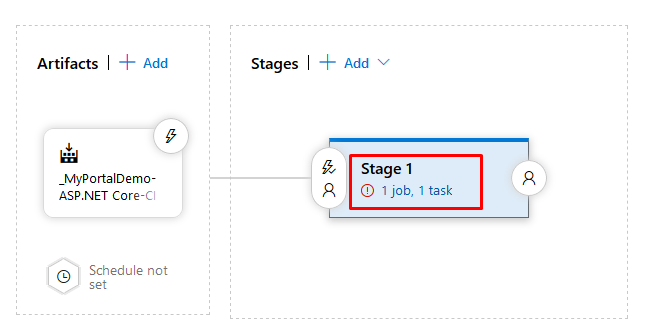
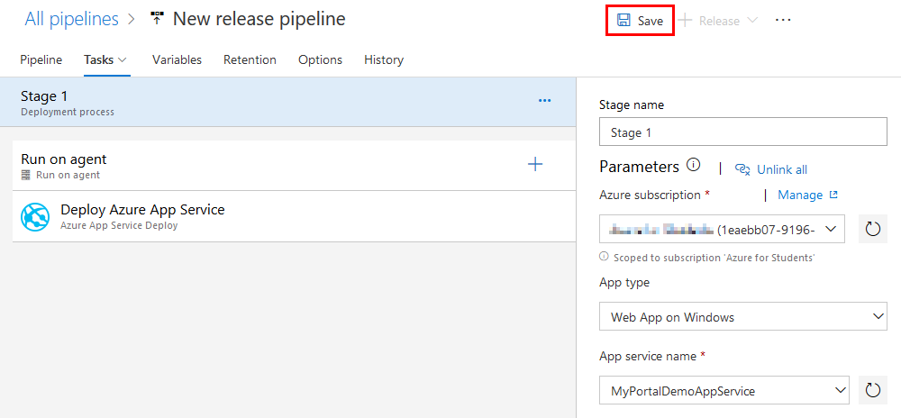
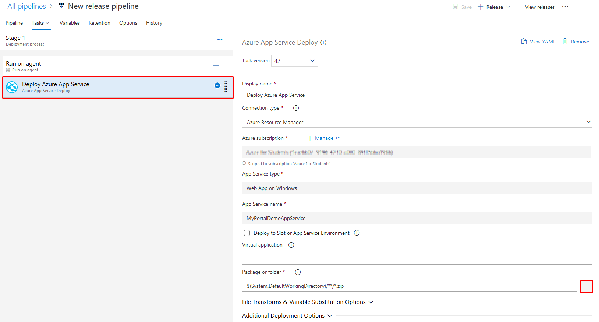
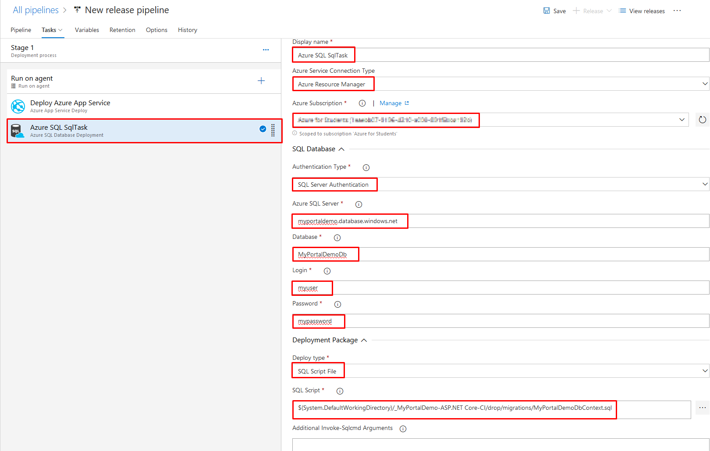

# Setting Up an Azure Pipeline for ASP.NET ZERO Core MVC 

In this tutorial, we will see how to create an Azure CI/CD pipeline for a fresh copy of ASP.NET Zero MVC Core project, hosted on GitHub. At the end of the tutorial we’ll be ready to deploy our web project to Azure App Service by just clicking a button. First of all create a demo project from aspnetzero.com and add the project to your private GitHub. For this sample, we will create a project named as `MyPortalDemo` (MVC Core project).

## What's Azure Pipelines?

Azure Pipelines let us to create different jobs which automates CI/CD processes. There are plenty of predefined tasks by Microsoft and by third party vendors. It helps you to continuously build, test and deploy to any platform and cloud. See https://azure.microsoft.com/en-us/services/devops/pipelines/

### GitHub user? You’re covered.

If you are using GitHub as your source-control system, things are way more faster. Azure Pipelines can fetch the source from your GitHub. And it’s free for 10 parallel jobs and unlimited minutes for open source projects. Check out [https://github.com/marketplace/azure-pipelines](https://github.com/marketplace/azure-pipelines/)

Click the “**Install it for free”** button to continue…




## Start Your New Azure Pipeline

Go to https://azure.microsoft.com/en-us/services/devops/pipelines/ and click the "Start free with Pipelines" button. You need to authenticate and grant permission for "Get started with Azure DevOps".



### Create a project

After you authenticate, you will see the new project screen. Enter your project name `MyPortalDemo`.



### Choose your source-code hosting service

Choose **Use the classic editor** to create a pipeline without YAML.


After that it will ask authorization to Azure Pipelines. After successful authorization, you will be redirected to your repository list. Select your repository for  `MyPortalDemo`. If you have not committed your project to GitHub, you can do it now.


Grant permission to your repositories with OAuth.



Then you will be able to see the list of your repositories on GitHub. Choose your repository and click **Continue**.


### Choose your template

The next step is choosing a template... We will choose the template **ASP.NET Core**. To find it type `ASP.NET Core` to the search box and then click the **Apply** button.


### Configure your pipeline steps

After the template is being created, you will see the below auto-generated pipeline steps.


As you see from the above image, **Some settings need attention**. Click that link which will redirect to source selection screen. We will again choose GitHub and pick our repository by clicking `...` button.


Other important setting is the **Project(s) to build and restore**. The default setting is `**/*.csproj` but this will break build process because Xamarin projects don't build with `dotnet build` command but need to be built with `msbuild`. So we need to build only the `*.Web.Mvc` project. For that, change it to `**/MyPortalDemo.Web.Mvc.csproj` as seen below.


### Additional pipeline steps for the MVC project

There are 3 additional steps we must add for ASP.NET Zero Core MVC project.

1. #### **Execute Yarn Task**

   For the MVC project, we have to run `yarn`  command in the `src/MyPortalDemo.Web.Mvc` folder. To do this click the `+` icon on top of the task list.

   

   

   Write `yarn` to the search textbox and click the **Get it free** button to install this new `yarn` task.

   

   

   After you install it, go back to original portal and refresh the page. Click the `+` again. Write `yarn` to the search textbox again. Now, you will be able see **Add** button. Click **Add** button to continue.

   

   After you add it, the new Yarn task comes to the end. Move it after **Build** step by drag & drop. Then write `src/MyPortalDemo.Web.Mvc`  to the **Project Directory**. This step is done. 

   

   

   Save the changes by clicking **Save** button on the toolbar.

   

   

   

2. #### **NPM Run Build Task**

   To add NPM Run Build task, write `command line` to the search textbox. Click the **Add** button of **Command Line** item.

   

   

   It will append it after right after the **Yarn** task. If it comes to the end, you need to drag & drop it after **Yarn** task. See the below screenshot for the right order.

   You can write any meaningful text to the **Display name** (eg: "NPM Run Build task")
   and for the **Script** write:

   ```bash
   cd src/MyPortalDemo.Web.Mvc
   npm run build
   ```

   

   

   Save the changes by clicking the **Save** button on the toolbar.

   

   

   

3. #### **Generate Migration Scripts Task**

   This is the last task! This task will generate SQL scripts into a file and we will run it against our database. For this task, we need to install a third party extension. Write `Entity Framework Core Migrations Script Generator` to the search textbox and click the **Get it free** button as seen on the below screenshot.

   

   

   After you install it, go back to your original portal and refresh the page. Now click the `+` again. Write `Entity Framework Core Migrations Script` to the search textbox again. Now, you will see **Add** button. Click **Add** button to continue.

   

   
   
   Move this new task after the **Publish** task by drag & drop. See the below screenshot. 
   
   Make the following configurations:

   * **Display name**: Generate Migration Scripts
* **Main Project Path**: `src/MyPortalDemo.EntityFrameworkCore/MyPortalDemo.EntityFrameworkCore.csproj`
   * **DbContexts**: `MyPortalDemoDbContext`
* **Startup Project Path**: `src/MyPortalDemo.Web.Mvc/MyPortalDemo.Web.Mvc.csproj`
   * **Target Folder**: `$(build.artifactstagingdirectory)/migrations`
   
   
   
   
   
   Save the changes by clicking the **Save** button on the toolbar.
   


We are ready to run the job for the first time. Click **Save & queue** button on toolbar. The pipeline will start for the first time.


Alternatively you can run your job by pressing **Queue** button on the toolbar.


So far, we have created a pipeline to get our project from GitHub, build, yarn, NPM run build, test and publish.  The next step is copying the publish output to Azure App Service. 

**Before starting this step, we assume that you have already created a web app on Azure App Services and set up your database**.


### Create release pipeline

Select Azure App Service deployment template.


#### Add an artifact

Click **Add an artifact** button and choose the related project as source.


Then click the default stage to edit.

On the new release pipeline, you will see **Deploy Azure App Service** options. Select your Azure subscription and then authorize it. Set `Web App on Windows` as your app type. Then pick your app service name from the list. Finally click **Save** button.




#### Choose Web.Mvc package for releasing

One important setting is the **package or folder** setting. ASP.NET Zero solution comes with 3 different web projects: `*.Web.Mvc`, `*.Web.Host` and `*.Web.Public`. We will release `*.Web.Mvc`. To set that package click the `...` button on the **Package or folder** row.



Choose  `*.Web.Mvc` and then click **Save** button on the top toolbar.


#### Web deploy as your deployment method

There's an additional deployment option: **Deployment method**. Check that you have configured your deployment method as **Web deploy**. If you don't set this option (*by default it's not set to Web Deploy*), you cannot use the file system to write logs. Although writing logs to file system is not recommended for Azure, it may require you while you startup your project for the first time. (If you want to read more about logging on Azure, check out  https://docs.microsoft.com/en-us/azure/security/azure-log-audit.)


#### Running the database migrations

We will add another task to run the migration script against our database. For this task click the `+` button and write `Azure SQL Database Deployment` to the search textbox. And then click the **Add** button next to **Azure SQL Database Deployment** task.


After adding this task. Configure this step as seen below:




Click the save button after the changes.


#### Release for the first time

Now we are done! Click the **Create release** button on the top toolbar and click **Create** on the new opened dialog. This will copy our last publish output to the selected Azure App Service.


When you see the green tick for your release, it means it's successfully completed.


### Conclusion

We have successfully set up an Azure Pipeline for an ASP.NET Zero MVC Core project. You can start this pipeline by clicking **Queue** button on the **Builds** menu. But you can also, enable continuous integration by clicking the relevant checkbox in the **Triggers** tab. We will not cover this feature. 

To run the whole process, go to **Builds** menu and on the top-right, there is **Queue** button. Click to start your job. 

